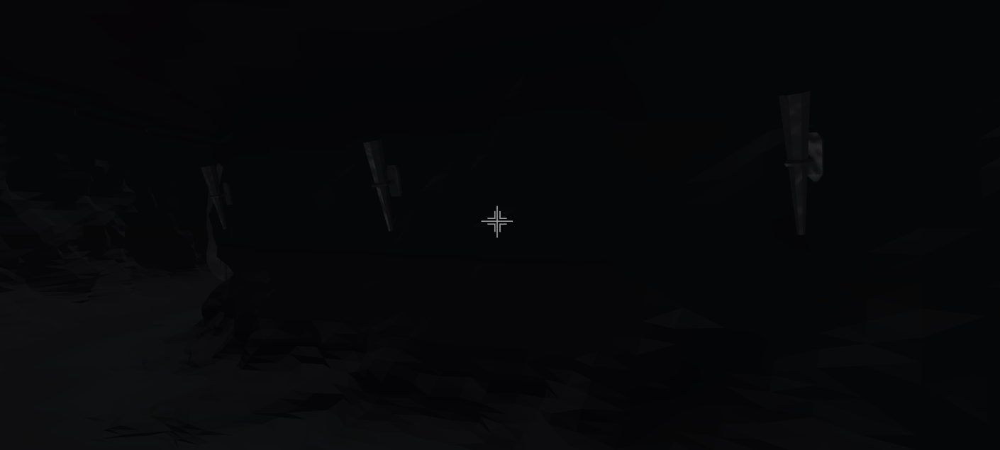
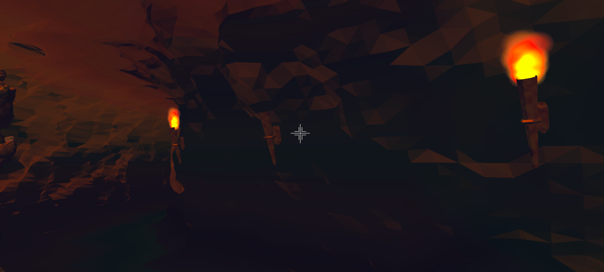
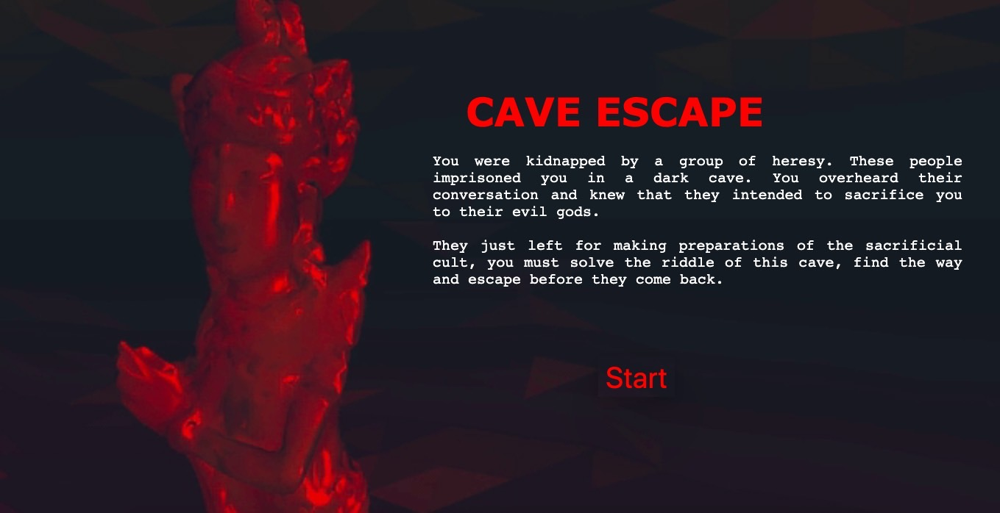

# CS174A Final Project
# Cave Escape by Team In-N-Out 
## Game Description

* **Background**:  
  You were kidnapped by a group of heresy. These people imprisoned you in a dark cave. You overheard their conversation and knew that they intended to sacrifice you to their evil gods. They just left for making preparations of the sacrificial cult, you must solve the riddle of this cave, find the way and escape before they come back.  
  
* **Implementation**:  
  1. **Clone or download** this repository from GitHub.  
  2. **Serve the folder over HTTP.** The game uses ES modules and WebGL; opening HTML files directly as `file://` often breaks loading, so always use a local server.  
     - **Development with live reload (recommended):** install [Node.js](https://nodejs.org/), then from the project root run `npm install` and `npm run dev`. A browser window opens **start.html**, and when you save changes to `.js`, `.html`, or `.css` files the page reloads automatically. If port `8000` is already in use (for example by another `server.py`), live-server picks another port; check the URL printed in the terminal.  
     - **Python:** from the project root run `python3 server.py`. Open `http://127.0.0.1:8000/start.html` (or whatever port is printed). You can set a starting port with the environment variable `PORT` (for example `PORT=9000 python3 server.py`). If the chosen port is busy, the script tries the next ports automatically.  
     - **Shortcut scripts:** double-click **host.bat** (Windows) or **host.command** (macOS) to run `server.py` the same way.  
  3. Start playing from **start.html** using the `http://` URL shown by your server.  

* **Deploy (Vercel):**  
  Import this repo in the [Vercel](https://vercel.com) dashboard. Use framework preset **Other**, leave the build command empty, and leave the output directory empty. The included **vercel.json** rewrites `/` to **start.html** so the deployed root URL shows the start screen instead of jumping straight into **index.html**.  

* **Controls**:  
  
  1. Move around with **W, A, S, D**  
  2. Look around with **the mouse**  
  3. Pick up items by **clicking**  

* **What you can do with our game**:  

  1. Interaction by clicking items  
  2. Escape the room with the hints  
  3. Look and move around in the cave  

## Project layout

* **`start.html` / `index.html` / `end.html`** — Start screen, main WebGL game, and ending credits.  
* **`styles/`** — `game.css` (main game page), `start.css`, `end.css` for the shell screens.  
* **`js/shell-fit.js`** — Makes the start/end full-bleed backgrounds track the window size (`data-shell-fit` on `<html>`).  
* **`src/app.js`** — ES module entry: loads framework globals, the 2D fire canvas, `playSound`, and the WebGL `Canvas_Widget`.  
* **`src/framework-globals.js`** — Sets `window.getAngle` for first-person controls in `lib/common.js`.  
* **`src/main-scene.js`** — Registers **`CaveScene`** in `defs` as **`Transforms_Sandbox`** for the built-in code navigator.  
* **`src/cave/cave-scene-base.js`** — Scene setup: shapes/materials, mouse picking, lights, camera base.  
* **`src/cave/cave-scene.js`** — **`CaveScene`**: world drawing and escape transition.  
* **`src/cave/build-cave-shapes.js`** — Builds the OBJ shape table and scales cave UVs.  
* **`src/cave/constants.js`** — Picking IDs and shared URLs (e.g. fire ambience embed).  
* **`src/cave/game-input.js`** — Shared state for gun / key flow plus `randomInt()`.  
* **`src/game-ui.js`** — `tempAlert()` and `installGameUi()`.  
* **`src/fire-particles.js`** — 2D fire on `#surface` for the dynamic flame texture.  
* **`lib/`** — Course framework: `tiny-graphics.js`, `tiny-graphics-widgets.js`, `common.js`.  
* **`assets/`** — Static media only, by type: **`audio/`** (e.g. gun shot), **`models/`** (`.obj`, including `models/cave/`), **`textures/`** (`.png` / answers), **`ui/`** (crosshair, favicon), **`shell/`** (start/end page GIFs).  

## Who did what
* Jingyi Zuo:  

  Mouse control parts. Project the 2D movement of mouse into 3D world, which helps realizing the lookaround and movearound feature. Read the mouse movementX and movementY each frame. Based on the relative change of mouse position, calulate the perspective and camera movement.   
  
  
  Mouse picking with framebuffers. Set up an off-screen framebuffer inwhich each item has an unique and uniform color (via a shader extends from Phong_Shader). By each click, read out the color of pixels on off-screen framebuffer in Webgl-Manager Class and pass it back to our check function. Reading out pixels in mousedown event and checking in mouseup event.  
  
  Implement light changes in the game.  
  
  Game logics.  
  
* Jiani Liu:

  Design some game puzzles.
  
  Mouse picking. Using framebuffer to render interactive objects into different colors on offscreen, and binding the scene into offscreen framebuffer. Then, the color corresponding to the coordinates of the aim can be read and the program can determine which object is selected. 
  
  Fire simulation, which essentially simulates fire on cave through particle diffusion. Each particle is assigned with coordinates, rgb value, life time that change with time. Therefore, particle diffusion simulates the shape of the flame. The rgb values simulate the flame with yellow center and red outter part. Flames are imported into the scene via screen to texture. 
  
 
  

 
 Sound effects.

* Weikang Yang:

  Design game scene.
  
  Generate the 3D models. Use Blender 2.80 to generate the 3D models, then export them as obj files. Further, use tiny graphics/ obj-files-demo to import these models into the project, construct them as the game scene. Add features of mouse clicking, etc. 
  
  Create and design the GAME START and GAME END pages . To improve the user experience, create two new .html files, use HTML and CSS to create button menu in the START page, link the button to the index.html which is the context of the game. Further, to make landscaping of the pages, record the game scene video and convert to .gif file and use it as background. 
  Test the game to check if the features implement correctly through Postman etc. 

    
  Design the background of the game.
  
  
--------------------------------------------------------------------------------------------------------------------------------------------------------------
Our project is a first-person room escape game. The player will control a person locked in a room and try to find clues and props in order to get out.  
There are currently two puzzles in the room. Player needs to solve them in a certain order to get out of the room. When the main character turns off the light, a fluorescent password will appear. Then the character can open a safe box using the password. A pistol will appear and the character then can broke the door lock with the pistol and escape. The interactions involved in the game are:  
  The movement of the protagonist's position and the changing point of view.  
  The main character can click items in the room and trigger certain events.  
Clickable items:  
  Light switch: turn on/off the light.  
  Safe box: the password input interface will appear. Player can input numbers.  
  Pistol: appear when the safe box is open. The character can hold the pistol by clicking. After that clicking is equal to shooting.  
  Door: If the character is not equipped with a pistol, a message “locked” will pop up. If the character is equipped with a pistol and clicks, it will be destroyed. Game over.  
  We will use vertex arrays indexing, polygons, and interpolation to model the room and the props. Viewing and projections will be used to simulate the first-person point of view. We also use lighting in order to accomplish one of the puzzles. We may use Ray Tracing to improve the feeling of presence.  
  We may also use the skinning technical introduced on this link:
https://webglfundamentals.org/webgl/lessons/webgl-skinning.html  

